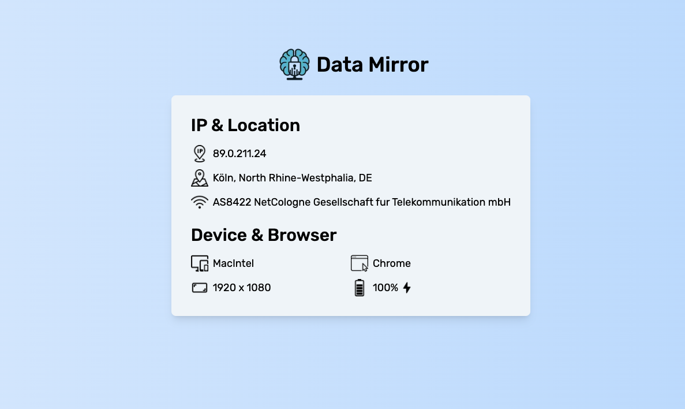

# Data Mirror

<p align="center">
  
</p>

<p align="center">
  A basic, modern Next.js application that displays information about you.
</p>

<p align="center">
  <a href="#features">Features</a> •
  <a href="#demo">Demo</a> •
  <a href="#installation">Installation</a> •
  <a href="#license">License</a>
</p>

## Features

Data Mirror provides real-time information about you, including:

- **IP Address Detection**: Accurately identifies and displays visitor IP addresses
- **Geolocation**: Shows city, region, and country information
- **ISP Details**: Displays Autonomous System (AS) information and service provider
- **Device Information**: Detects platform (Windows, MacOS, iOS, Android, etc.)
- **Browser Detection**: Identifies the visitor's browser
- **Screen Information**: Shows screen resolution and zoom level
- **Battery Status**: Indicates whether the device is charging

## Demo



## Installation

```bash
# Clone the repository
git clone https://github.com/snickers03/data-mirror.git

# Navigate to the project directory
cd data-mirror

# Install dependencies
pnpm install
```

## License

This project is licensed under the "THE BEER-WARE LICENSE" (Revision 42):

```
As long as you retain this notice you can do whatever you want with this stuff.
If we meet some day, and you think this stuff is worth it, you can buy me a beer in return.
```

---

<p align="center">
  Made with ❤️ by <a href="https://niklas.sh" target="_blank">niklas.sh</a>
</p>
